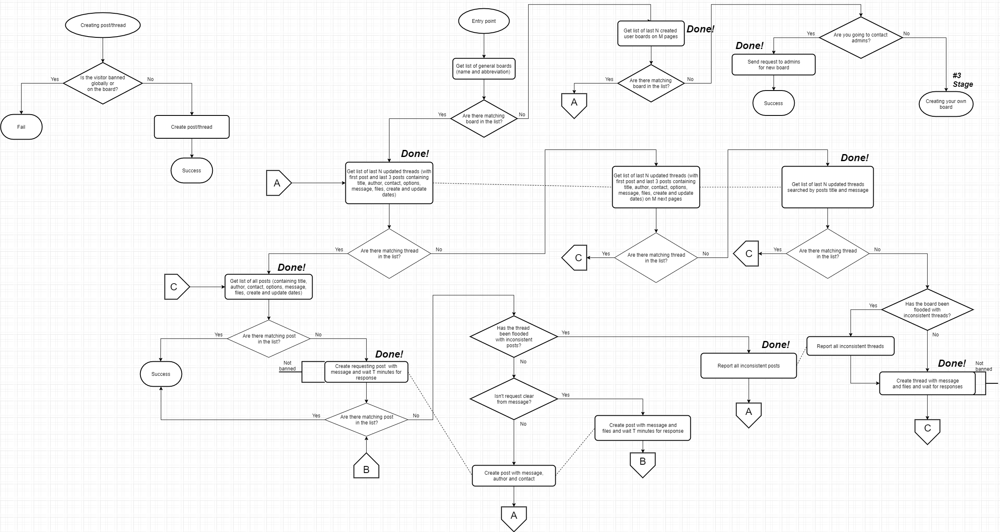

# Имиджборда на Django

## Основные сценарии:

1. Постинг
2. Модерация
3. Пользовательские доски

### 1. Постинг

Посетитель может создавать треды и постить сообщения с указанием названия, имени, контакта (электронная почта или сайт) и файлов (картинок, видео, аудио, электронных книг до 4 штук до 10 МБ общего размера);

### 2. Модерация

Посетитель может кидать жалобы на посты. А модерация - банить пользователей на определенный срок как на отдельной доске, так и на всей имиджборде;

### 3. Пользовательские доски

Пользователи (зарегистрированные посетители) могут создавать свои доски, задавать им бамплимит и спам-слова, назначать на них администраторов и модераторов, банить пользователей;

## Сервисы

Имиджборда состоит как минимум из 2-х сервисов: сервис для рендера React-страничек (Next.js) и REST API сервис (Django). Хотя из-за возможности загружать файлы больших размеров возможна большая нагрузка на сервер, так что придется создать высокопроизводительный микросервис для загрузки и валидации файлов;

## Модели

## Сценарий постинга
