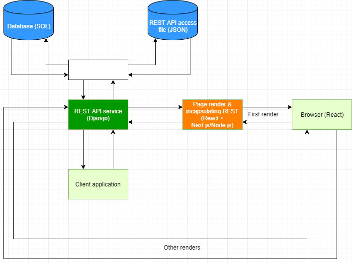
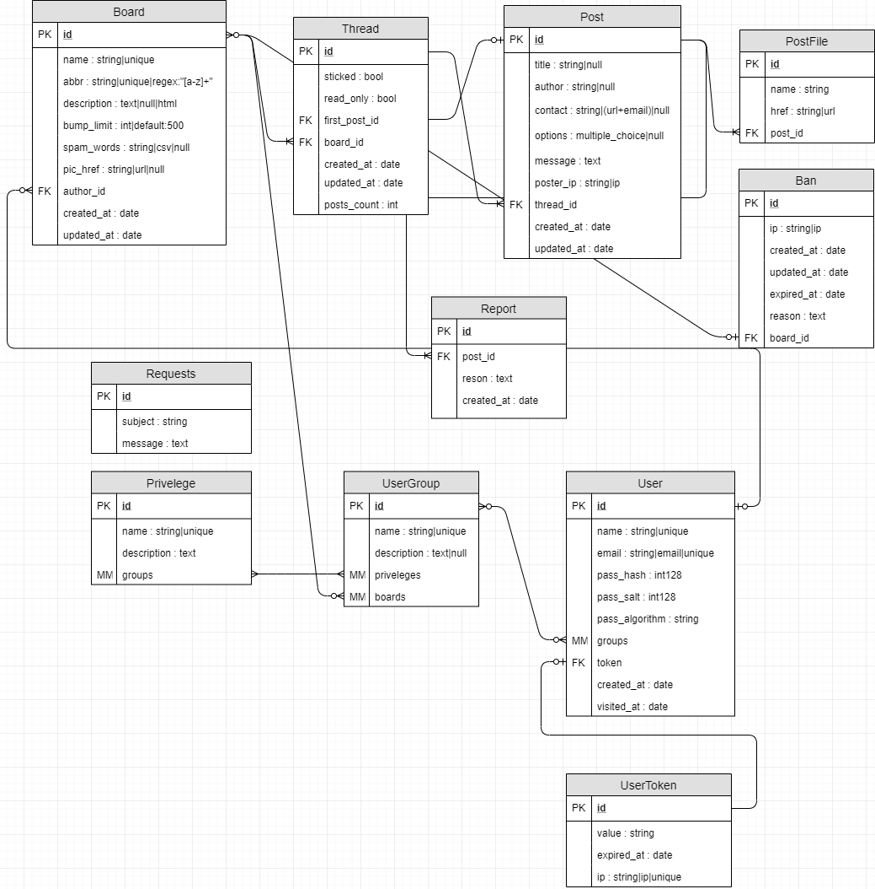
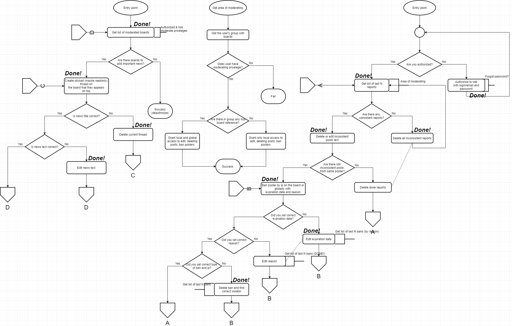
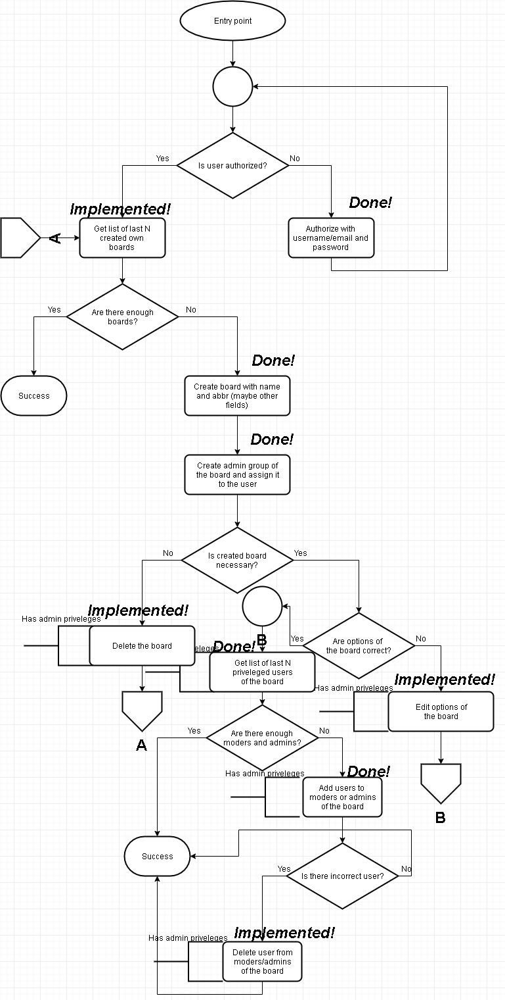

# Имиджборда на Django + React

## Основные сценарии:

1. Постинг (релиз 1.0)
2. Модерация (релиз 1.0)
3. Пользовательские доски, (глобальное) управление досками (релиз 1.0)

### 1. Постинг

Посетитель может создавать треды и постить сообщения с указанием названия, имени, контакта (электронная почта или сайт) и файлов (картинок, видео, аудио, электронных книг до 4 штук до 5 МБ общего размера;

### 2. Модерация

Посетитель может кидать жалобы на посты. А модерация - банить пользователей на определенный срок как на отдельной доске, так и на всей имиджборде;

### 3. Пользовательские доски, (глобальное) управление досками

Пользователи (зарегистрированные посетители) могут создавать свои доски, задавать им бамплимит и спам-слова, назначать на них администраторов и модераторов, банить пользователей. Глобальные админы могут проводить те же самые операции со всеми досками имиджборды;

## Сервисы

Имиджборда состоит как минимум из 2-х сервисов: сервис для рендера React-страничек и инкапсуляции доступа к REST API (Next.js/Node.js) и REST API сервис (Django). Доступ  к REST API осуществляется посредством UID токенов. Каждый контроллер REST API оборачивается в специальный контроллер который;

## Модели

## Сценарий постинга

## Сценарий модерации

## Сценарий управления досками
